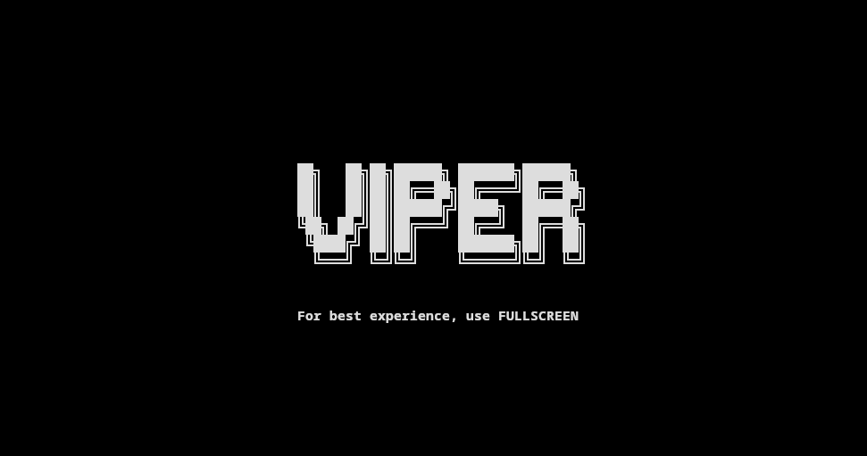
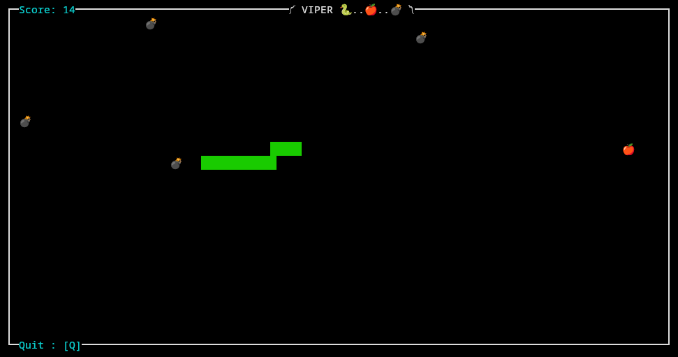
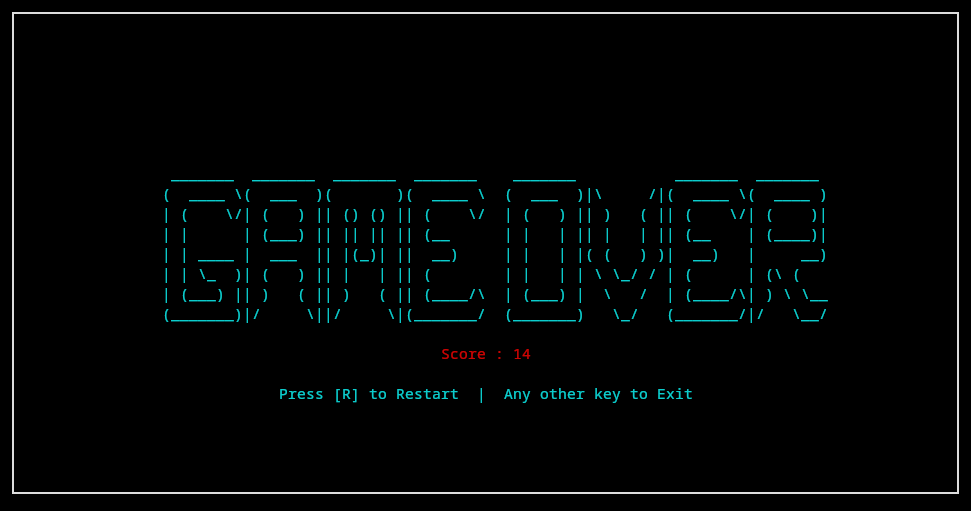

# VIPER Snake Game 🐍

A modern terminal-based **Snake game** with colorful Unicode characters and dynamic gameplay. Inspired by classic Snake, VIPER adds **bombs**, **fruit**, and a **restartable outro screen** with ASCII art.  

---

## 🧩 Features

- Terminal-based gameplay using Python's `curses` library.
- Snake, apple 🍎, and bombs 💣 rendered with **Unicode symbols**.
- Dynamic bomb spawning and disappearance to make the game less predictable.
- Score display updated in real-time at the top of the game window.
- **Wrap-around walls**: snake moves seamlessly from one side to another.
- **ASCII art outro** with final score and restart option.
- Restart game by pressing **R**, or exit with any other key.
- Adaptive terminal size handling with error messages if the window is too small.
- Color-coded elements:
  - Snake: Green  
  - Apple: Red  
  - Bomb: Black  
  - Borders & titles: Cyan  

---

## 📸 Screenshots

**Intro:**
```
         ██╗   ██╗██╗██████╗ ███████╗██████╗
         ██║   ██║██║██╔══██╗██╔════╝██╔══██╗
         ██║   ██║██║██████╔╝█████╗  ██████╔╝
         ╚██╗ ██╔╝██║██╔═══╝ ██╔══╝  ██╔══██╗
          ╚████╔╝ ██║██║     ███████╗██║  ██║
           ╚═══╝  ╚═╝╚═╝     ╚══════╝╚═╝  ╚═╝

```
## 🎮 Gameplay Preview






**Gameplay:**

༼ VIPER 🐍..🍎..💣 ༽

Score: 0 (Initialisation)

[Snake moves around the terminal eating apples and avoiding bombs]


  
**Outro:**
```
 _______  _______  _______  _______    _______           _______  _______ 
(  ____ \(  ___  )(       )(  ____ \  (  ___  )|\     /|(  ____ \(  ____ )
| (    \/| (   ) || () () || (    \/  | (   ) || )   ( || (    \/| (    )|
| |      | (___) || || || || (__      | |   | || |   | || (__    | (____)|
| | ____ |  ___  || |(_)| ||  __)     | |   | |( (   ) )|  __)   |     __)
| | \_  )| (   ) || |   | || (        | |   | | \ \_/ / | (      | (\ (   
| (___) || )   ( || )   ( || (____/\  | (___) |  \   /  | (____/\| ) \ \__
(_______)|/     \||/     \|(_______/  (_______)   \_/   (_______/|/   \__/
```
Press [R] to Restart | Any other key to Exit

---

## 🛠️ Installation

1. Clone the repository:
```bash
git clone https://github.com/priyankaa-gn/VIPER.git
cd VIPER
```

2. Run the game:
```bash
python3 snake_game.py
```
Note: Ensure your terminal supports Unicode emojis for the best experience

## Controls

Arrow keys: Move the snake.

R key: Restart the game after a game over.

Any other key: Exit the game.(during outro)

## 📦 Dependencies

Python 3.10+

Standard Python libraries:

curses

time

random

No additional installation required.

